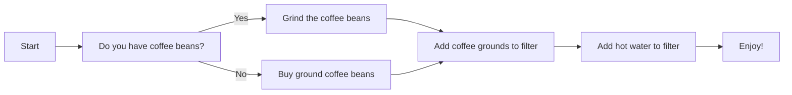
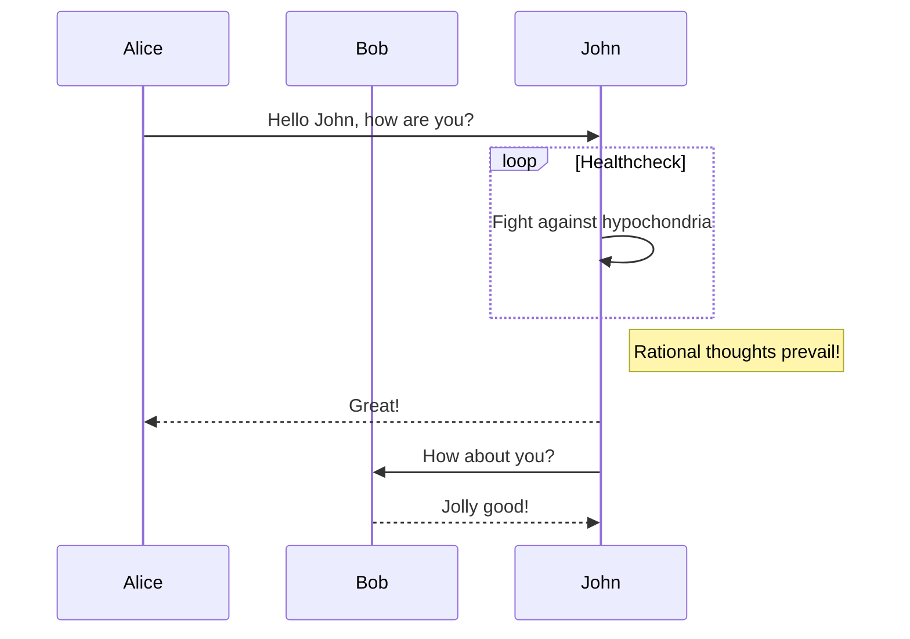
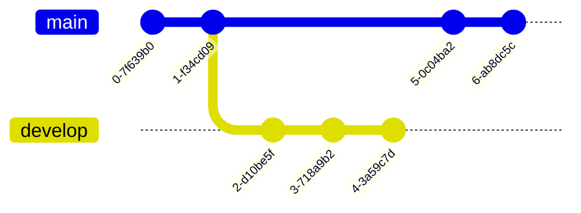
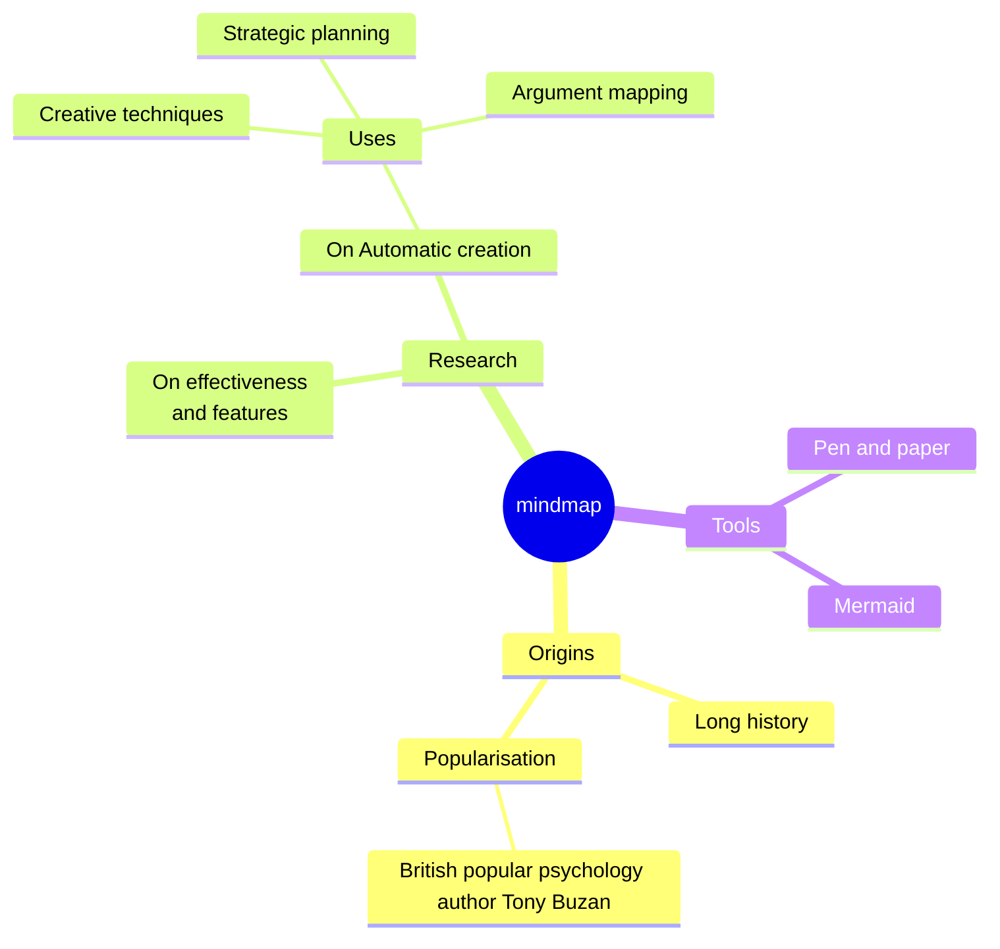
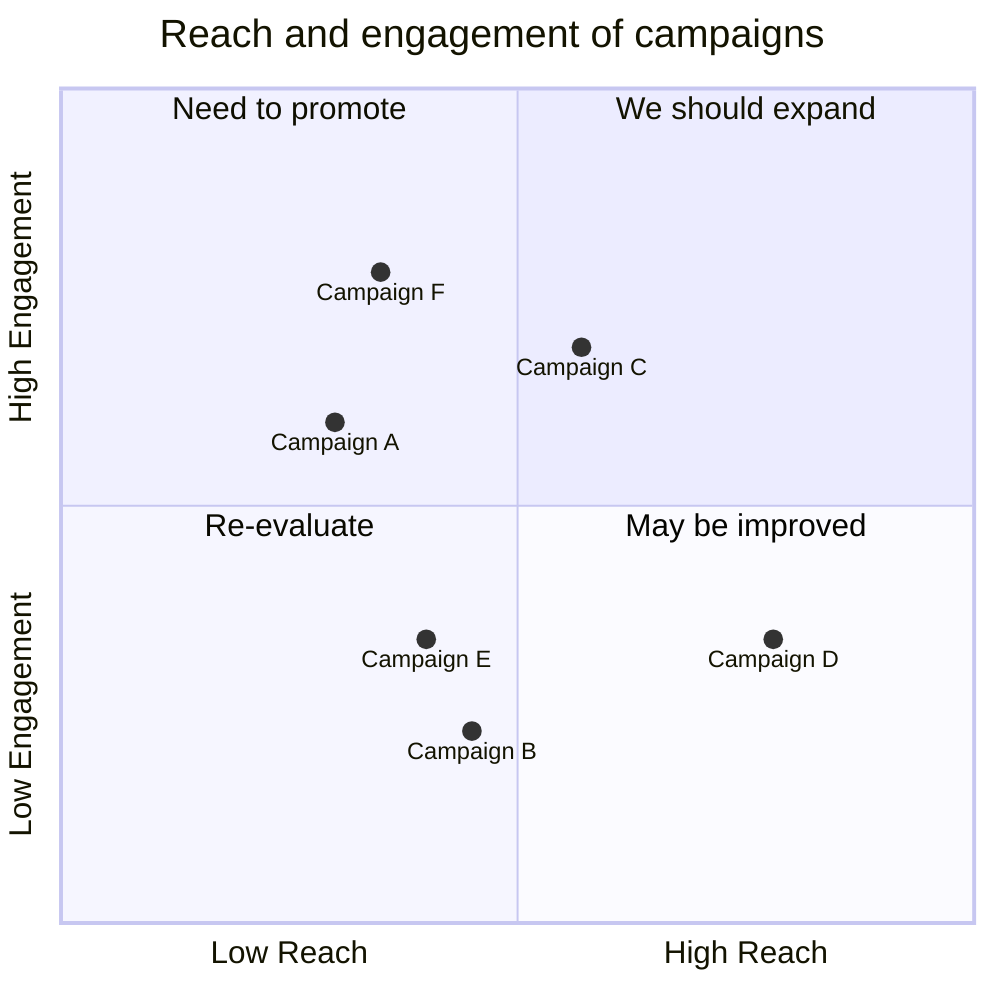

 # Mermaid diagrams

 Creating this file to check how github behaves with Mermaid and what VS Code plugins might be useful.

 All examples adopted from Mermaid official docs and examples - [here](https://docs.mermaidchart.com/mermaid/intro)

 ## Flowchat

 A very basic exampe below. Lots of edges and shapes are available.

 ```mermaid
 graph TD;
      A-->B;
      A-->C;
      B-->D;
      C-->D;
```



## Sequence diagrams

Probably the most important type of diagram for visualizing the various flows.


## Gitgraph

This could be used to visalize how we work with branches etc. in the CAMARA project and/or DN specific WoW (if any)




## Mindmap

This is my favourite diagram type for maintaining backlog / list of ideas, etc. Very lightweight and visual.



## Quadrant



## More examples

* [Link1](https://docs.esa.io/posts/308)